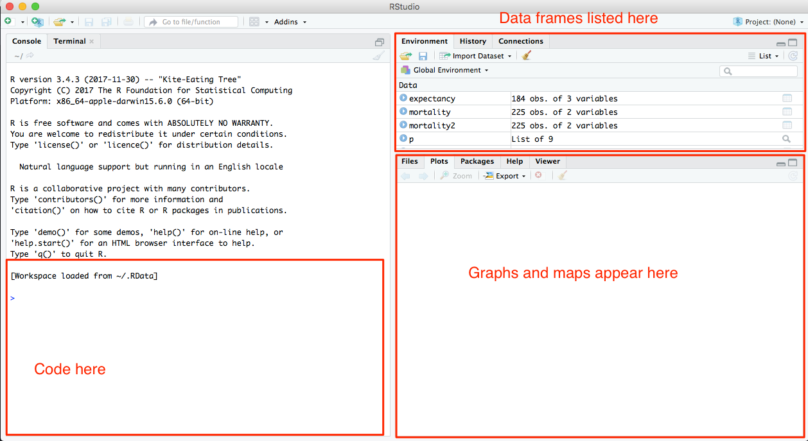

# Mapping with R

First and foremost, I want to be clear on this: Mapping is hard. There is a lot going on, and a lot of external libraries necessary to make it work. So this won't be as easy as working with standard datasets and libraries.

We're going to borrow heavily from John Burn-Murdoch's [good work](https://twitter.com/jburnmurdoch/status/981074810020204544) that he graciously included the code [here](https://gist.githubusercontent.com/johnburnmurdoch/2dd39f56631ffffe4a99633c76781a1e/raw/d620455ad45b07e15c141318c0a9a437ffeb5096/main.R).

To do this, we're going to have to get out of Jupyter Notebooks and Anaconda, which has terrible support for various mapping libraries. We're going to use the industry standard tool for using R, which is called R Studio. To install R Studio, we have to first install R by downloading your computer's version [here](https://cran.rstudio.com/).

Then install RStudio by going [here](https://www.rstudio.com/products/rstudio/download/#download).

Open R Studio. Here's what it will look like. We're going to do our work in the console on the left.



Now we have to set up our environment by installing all the packages we're used to plus more.

```R
install.packages('devtools')
install.packages('sf')
devtools::install_github("hrbrmstr/albersusa")
install.packages('tidyverse')
install.packages('utils')
```

Now let's load some libraries up:

```R
library('sf')
library('ggplot2')
library('dplyr')
library('utils')
library('magrittr')
library('albersusa')
```
First things first, let's get some map data from the `sf` library. Then let's get our population data we used in the Live Fire Exercise last time. This code adds a couple of directives that tell R to load a column in as text, not numbers, to preserve the leading zeros. This will be important later.

```R
county_geom <- counties_sf("aeqd")

population <- read.csv(url("https://www2.census.gov/programs-surveys/popest/datasets/2010-2017/counties/totals/co-est2017-alldata.csv"), colClasses=c("STATE"="character", "COUNTY"="character"))
```
This part is like you are accustomed to. Let's create a new dataframe, filter out statewide totals, create a couple of fields to create a new idenfitier out of state and county fips codes and calculate percent change. Then we'll slim our dataset down to just the fields we need.

After that, we'll join our new data to the map using the fips code as the join condition.

```R
countygeoid <- population %>%
     filter(SUMLEV==50) %>%
     mutate(
         fips = paste(STATE, COUNTY, sep=""),
         change = ((POPESTIMATE2017-POPESTIMATE2010)/POPESTIMATE2010)*100
     ) %>%
     select(c(fips, STNAME, CTYNAME, change))

nation <- county_geom %>% inner_join(countygeoid, by="fips")
```

Now, before we map, let's make a theme for our map, called `map_theme` that gets rid of lots of the extra cruft that `ggplot2` adds to maps.

```R
theme_map <- theme(
     panel.background = element_blank(),
     plot.background = element_blank(),
     panel.grid.minor = element_blank(),
     text = element_text(family = "Helvetica", size=16),
     axis.title = element_text(size=12),
     axis.ticks = element_blank(),
     strip.background = element_blank(),
     panel.grid.major = element_line(colour = 'transparent'),
     axis.text = element_blank()
)
```

Now let's make a map. After all this, it's similar to what you are used to: use ggplot, tell it the dataframe, then use a special geom called `geom_sf` to render the map. If it's all gone well, we should see a map.

```R
ggplot(nation) +
     theme_map +
     geom_sf(col="transparent", aes(fill=change)) +
     scale_fill_distiller(type="div", direction=-1)
```

What's the problem here?
