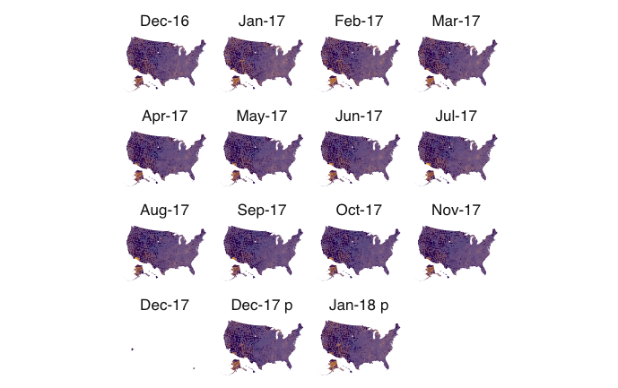

# Lattice maps
### aka my computer is on fire

Lattice maps are a very cool way of doing small multiples with maps. But they are not for the uncommitted -- they're large, they require time and processing, and you are going to hear your laptop fan.

First we'll get set up with what we'll need.

```r
library(dplyr)
library(ggplot2)
library(sf)
library(albersusa)
library(repr)
options(repr.plot.width=11, repr.plot.height=8)
```
Next we'll get our data, which is a file of local area unemployment rates by county from the Bureau of Labor Statistics from Dec. 2016 to Jan. 2018. I've cleaned out some junk from the BLS. [You can download my data here](https://www.dropbox.com/s/j6qiad39f9l27nl/laucntycur14.csv?dl=0).

```r
unemp <- read.csv("~/Dropbox/JOUR407-Data-Visualization/Data/laucntycur14.csv", colClasses=c("State"="character", "County"="character"))
```

Now, just like our previous mapping exercise, we'll create a `fips` field so we can join the data to the map.

```r
geoid <- unemp %>% mutate(
  fips = paste(State, County, sep="")
)
```

Now we'll bring in a county map.

```
county_geom <- counties_sf("aeqd")
```

Ths is where lattice maps get different. With a single county map, we just wanted to join the map to the data and we had one county for one mapped county. With lattice maps, we need to join the MAP to the DATA. Meaning we're going to have lots of copies of the map around because we've joined them to the data that has lots of repeats of the county, one for each year the dataset covers.

```
nation <- geoid %>% inner_join(county_geom, by="fips")
```
We'll set up our map theme to get rid of all the cruft.

```
theme_map <- theme(
  panel.background = element_blank(),
  plot.background = element_blank(),
  panel.grid.minor = element_blank(),
  text = element_text(family = "Helvetica", size=16),
  axis.title = element_text(size=12),
  axis.ticks = element_blank(),
  strip.background = element_blank(),
  panel.grid.major = element_line(colour = 'transparent'),
  axis.text = element_blank()
)
```

This bit is new. Our dates aren't really dates, and we need them in order. So we're going to create a new field called period_f, which is a factor, and we're going to spell out the order we want them to be in.

```
nation$period_f = factor(nation$Period, levels=c('Dec-16', 'Jan-17','Feb-17','Mar-17','Apr-17','May-17', 'Jun-17', 'Jul-17', 'Aug-17', 'Sep-17', 'Oct-17', 'Nov-17', 'Dec-17', 'Dec-17 p', 'Jan-18 p'))
```

Now, we make a map. If you've followed along until now, get comfortable. This takes a while.

```
ggplot(nation) + theme_map + geom_sf(col="transparent", aes(fill=Rate), color = NA) + scale_fill_gradient(low = "#00005C", high = "#F5AD00", guide = FALSE) + facet_wrap(~period_f)
```

The facet_wrap works just the same as other facet charts.

The result:


