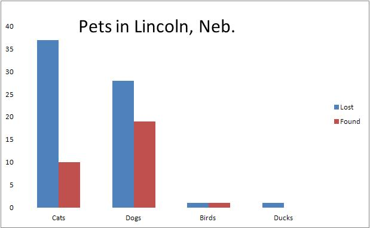

#Lost, Found pets in Lincoln#

**By: Christine Scalora**

In the past month or so, Lincolnites' pets have been lost, and found, across the city. One dog was even found in Kansas City. The City of Lincoln Animal Control posts the information online, including area where the animals were last seen.   

**Source: City of Lincoln Animal Control**

<iframe width="500" height="300" scrolling="no" frameborder="no" src="https://www.google.com/fusiontables/embedviz?q=select+col10+from+1V1EDQiY6IJHB5k4XvYxI0_z-ClVrOa3cQcdGrKI&amp;viz=MAP&amp;h=false&amp;lat=40.79733258467968&amp;lng=-96.64774571477062&amp;t=1&amp;z=11&amp;l=col10&amp;y=2&amp;tmplt=2&amp;hml=ONE_COL_LAT_LNG"></iframe>